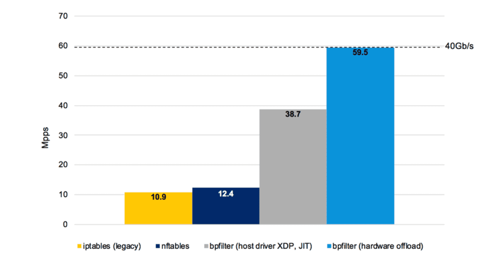

# eBPF-Research
###### Documenting eBPF in a tutorial-style format as I learned it myself. Note that this is quite old and only covers the basics (I still need to write about BPF Maps!). The setup instructions may also differ depending on your system. 


## What is eBPF?
First of all, eBPF stands for **e**xtended **B**erkeley **P**acket **F**ilter. Now onto a basic level, eBPF allows you to run code kernel-side. Typically programs are meant to be run in userspace, this is where most programs run. Userspace programs then can interact with the machine via system calls to the kernel. eBPF programs on the other hand, run as part of the kernel. Because of this, they are much more restricted than userspace programs but are a lot more low level and much more efficient. 

eBPF programs must also pass a verifier check before they can begin execution, the [verifier](https://github.com/torvalds/linux/blob/9e9fb7655ed585da8f468e29221f0ba194a5f613/kernel/bpf/verifier.c) is a part of the kernel (it's about a 14000 line file) that makes sure eBPF programs are safe to run. It will commonly check for:
* Unbounded loops/While true loops
* Infinite looping/infinite recursion
* Invalid memory accesses (accessing memory beyond what's allocated to the program)
* Much much more, the verifier is an incredibly complex program.

There are ways the programmer can "make the verifier happy" so to speak. Those methods will be discussed later on. 

It's evident that eBPF is used in the networking sector (given its definition, Berkeley *packet* filter). Due to its nature in low level packet handling, its most common application is in DDoS mitigation. Companies like [Clouflare](https://www.cloudflare.com/), [Path.net](https://path.net/), [Corero](https://www.corero.com/) and many others benefit from eBPF technology to protect servers from attacks. Since eBPF runs very low on the network stack, an eBPF program can intercept malicious packets long before they are able to take up server resources, thus mitigating the damage that would've been done by that packet. 


## How can we benefit from eBPF?

We can use eBPF to mitigate attacks against our own servers. This would be done through one of eBPF's program types, XDP. E**X**press **D**ata **P**ath (XDP) is simple and easy to use when it comes to packet handling and mitigation. An XDP program would run on a network interface and get called on each incoming packet to that interface. The program would look for abnormalities in packets to drop those packets. 

We can specifically benefit from XDP with application filters. Application filters are commonly XDP programs that are built around a specific application. An 'application' in this case just represents any targeted program that would be running on a server, it can be a game, a database, a webserver or any other public facing service. The goal of these application filters are to only pass through legitimate traffic while preventing any malicious traffic. This kind of filtering has proven to be more effective than general purpose filtering but can only protect against a single type of service. 

### An example of how an application filter can work

Let's say we're trying to protect a webserver server from DDoS attacks. Now say our webserver runs on port 8080 so we already know that 8080 will be the port used for filtering in our application filter. Next we know that a webserver uses only the TCP protocol, so we can allow only TCP traffic to pass through while blocking all other IP based protocols. This is just the basic information, however when working on application filtering there are much more nuanced quirks to an application. For example we would also need to look into the following:

* How the application uses it's protocols (I.e, a multiplayer game might use UDP for in-game data and TCP for initializing connections and downloading resources).
* How each packet is formed and structured.
* Looking into if the application uses other application layer protocols (such as HTTP) and filtering those as necessary.
* Rate limiting based on the application.

There are also more general purpose filtering methods that can filter generic attacks that aren't necessarily attacking a service such as:

* Port punching, closing all ports except for the ones in use. 
* Checking for malformed packets at each layer (Ethernet layer, IP layer, TCP, UDP, etc).

 

## The basics of eBPF and XDP programming

eBPF programming is drastically different than traditional programming due to it's hard restrictions on the use of external functions. Firstly, eBPF programming is not limited to any language, since at a basic level, you're just making syscalls to the kernel. Meaning that you can effectively develop eBPF programs in almost any language, given that there is support for making syscalls. However there are 4 languages in particular that are most widely used in eBPF development. Those languages are:

* C (The most supported language, has helper libraries like [libbpf](https://github.com/libbpf/libbpf) and [xdp-tools](https://github.com/xdp-project/xdp-tools))
* Go (With the help of [Go eBPF](https://github.com/dropbox/goebpf))
* Rust (With the help of [RedBPF](https://github.com/foniod/redbpf))
* Python (This is not a standalone eBPF development language, it's paired with C through the use of [bcc](https://github.com/iovisor/bcc))

While there are a growing number of eBPF supported languages, C is still the most widely used and supported language. All of the other libraries have their own limitations and missing support in some areas of eBPF. 

Now onto the workings of XDP programs in C. An XDP program in C will always start with a single function, this function is what gets executed every time a packet is received, this is also where our mitigations methods would take place. This function also takes in a single parameter, that being the [xdp_md struct](https://github.com/torvalds/linux/blob/master/include/uapi/linux/bpf.h#L6331) (link to the definition included). There are 2 variables in particular for now, the **data** and **data_end** variables. While these two variables are defined with type __u32 (unsigned 32 bit integer), they are actually pointers in disguise that need to be casted to void pointers. The data variable is a pointer to the first byte in the packet while the data_end variable is a pointer to the last byte in the packet. In other words, the packet data lies between these two pointers. 

There are other variables as part of the xdp_md struct however they are not needed for the basic implementation of an XDP filter.


## Writing and loading a basic XDP program

Writing XDP programs, or eBPF programs in general are a bit different from traditional programs code-wise. As mentioned before they are run from a single function which is executed through every packet. The following is a very basic example of an XDP filter.

```c
#include <linux/bpf.h>
#include <bpf/bpf_helpers.h>

SEC("xdp_pass")
int pass_filter(struct *xdp_md ctx) {
    return XDP_PASS;
}

char _license[] SEC("license") = "GPL";
```

1. The first bpf.h include is necessary for all BPF programs as it defines many important structs and methods for BPF programs.

2. As the name implies, the bpf_helpers header contains many helpers for BPF programs, they wrap many of the BPF syscalls into easy-to-use functions. In this example we're only using the "SEC" macro from this header, it defines ELF sections for the compiler. 

3. Next we have the main function called pass_filter, it gets defined under the "xdp_pass" section and takes in an xdp_md struct pointer called ctx. This represents the context of the packet we're passing in.

4. In the function pass_filter, we only return XDP_PASS. This is one of a few actions or return codes in XDP. XDP_PASS just means that we should let the current packet (as passed in by the ctx pointer) pass up through the network stack. There are a few more XDP actions such as:

   * XDP_DROP
   * XDP_TX
   * XDP_ABORTED
   * XDP_REDIRECT

   DROP and PASS are the most widely used in XDP filtering. DROP is the counterpart to PASS, it just means to drop the packet and do not let it continue up the network stack.

5. Finally we define a license section, using the GPL license. This is often necessary as the kernel will not let you load an eBPF program that uses GPL licensed functions without having a GPL license on your program. 

> Note: All XDP sample programs can be found in the samples folder included in the repo.

Now you can test this sample by compiling it into an object file and loading it into the kernel. Clang is currently the only compiler that supports bpf compilation so Clang must be installed. Once it's been installed, you can compile by running the following command:

```bash
clang -Wall -O2 -g -target bpf -c xdp_pass.c -o xdp_pass.o
```

This compiles the XDP program into an object file that can be loaded into the kernel. Unlike traditional programming, this does not have to be linked into an executable. 

> Note: If compilation fails, you may be missing some kernel headers. I have an [xdp-autosetup](https://github.com/TylerStAmour/xdp-autosetup) repository available which, upon executing run.sh, will install xdp-tools and *may* install the correct headers, depending on Kernel version and Linux distro.  

Once compiled, we can load this object file onto the kernel. We can do this through the use of xdp-tools. Xdp-tools contains various programs that can help with XDP development, such as xdp-loader. Traditionally, loading is done via the iproute command, but with xdp-loader, it's abstracted into a more simple command that also does some background tracking. Now onto loading, move to the xdp-loader directory within the xdp-tools repository. Now you can load the XDP program onto the kernel by running the following command:

```bash
./xdp-loader load -m skb (network interface name) (path to your XDP object file).o
```

If all goes well, this will load your program onto the kernel and attaches itself to the given network interface. You can also see all loaded XDP programs in a nice table with the following command:

```bash
./xdp-loader status
```

Through this, you should see your XDP program loaded onto the network interface you chose. That's great, but, it doesn't really do much. At this point it's a useless program as it just passes everything unconditionally, but this serves as a basic "Hello, World!" type program and ensures the environment is setup for further and more advanced development. Well before we go any further you would probably want to unload the previous program. You can do so with the following:

```bash
./xdp-loader unload (interface you chose) -a
```

This unloads all XDP programs on the interface. The -a specifies all XDP programs, if you wanted to remove a single one you could use the -i (program ID) flag instead. 

> Note: You can find the program ID in the xdp-loader status command.


## Additional information about XDP

This section will just contain some extra information about XDP and eBPF, it is nice to know but not required to understand. In the previous section, we loaded an XDP program using xdp-loader. We used the -m skb flag in that command. The -m represents "mode" while "skb" represents one of a few XDP modes. An XDP mode is just the way an XDP program is attached to the kernel, there are 3 possible modes to attach an XDP program:

1. SKB (Aka, generic mode)
2. DRV (Aka, native mode)
3. HW (Aka, offload mode)

The modes don't change how your XDP program will work, they only change how it will be run. While you can run XDP programs in generic mode on almost any system running a sufficiently new Kernel, you should look into the benefits of the other modes when applicable. 

1. Generic mode is considered the least efficient of all three modes, however it's benefit is its portability. Typically to run XDP programs, you need a network driver that supports it, except in generic mode when this driver gets emulated. This is what allows its portability to many systems.
2. Native mode is generally faster than the previous mode as it skips the emulation step. This mode is meant for users with a network driver that has XDP support, this support is generally found in enterprise hardware. 
3. Offload mode, as the name implies, allows you to offload programs onto the network card itself. This means that all the XDP processing gets done on the network card itself, instead of getting run by the CPU. While this has some performance benefits, its use is very niche as it has much less support than native or generic mode programs. This lack of features and support is mostly seen when using eBPF maps (which will be explored later).

The next topic of this section is the actual performance itself, how fast do XDP programs really run? Well, the answer is very fast. Before XDP started to creep into the standard for mitigation, iptables were and still are one of the most widely used methods of mitigation. Iptables aren't known for their speed though, evidently they won't compare to an eBPF program. The following is a chart comparing the number of packets handled by different filtering tools. 



> Source: https://cilium.io/blog/2018/04/17/why-is-the-kernel-community-replacing-iptables

While the eBPF program was running in offloaded mode, it still goes to show the drastic improvements by using eBPF and XDP. 


## Implementing filtering methods into XDP

There are many methods of filtration that we can create with XDP, however we'll start simple with port punching. Port punching is a very effective method of general filtering that should be applied whenever possible. It consists of only opening ports that we're using and keeping everything else closed. Simple, right? To implement this we have to first delve into packet parsing, specifically parsing the different headers of a packet (ethernet header, IP header, etc). Now let's get started. We'll be going back to the previous XDP example, we'll only be changing the name of the section and name of the function for conventional purposes.

```c
SEC("xdp_filter")
int xdp_filter(struct *xdp_md ctx) {
    void *data = (void *) (long) ctx->data;
    void *data_end = (void *) (long) ctx->data_end;
    
    struct ethhdr *eth = data;
    struct iphdr *ip = data + sizeof(*eth);
    
    if ((void *) ip + sizeof(*ip) <= data_end) {
        if (ip->protocol == IPPROTO_UDP) {
            return XDP_DROP;
        }
    }
    return XDP_PASS;
}
```

While this may seem complicated, it should be stated that most of this code is boilerplate code, meaning it is generally replicated across many XDP programs. However this still seems a bit unintuitive, so let's comment it to make a bit more sense out of it.

```c
SEC("xdp_filter")
int xdp_filter(struct *xdp_md ctx) {
    // These are standard, they convert the ctx->data and ctx->data_end values to
    // pointers. As mentioned before, data represents the pointer to the first byte of 
    // the packet while data_end represents the pointer to the last byte of the packet.
    void *data = (void *) (long) ctx->data;
    void *data_end = (void *) (long) ctx->data_end;
    
    // The two next lines are also pretty standard, they parse the Ethernet header
    // and the IP header. This gives us access to many of the information found in 
    // these headers (such as the packet's source address, destination address, 
    // protocol, etc). While you also have access to the Ethernet header, it generally 
    // isn't used much.
    struct ethhdr *eth = data;
    struct iphdr *ip = data + sizeof(*eth);
    
    // This if statement is to please the aforementioned eBPF verifier. 
    // The verifier doesn't like when there are any possibilities of errors 
    // so without this next line, the verifier would not allow the program to run. 
    // This is because it could produce an error if the packet was malformed. 
    // The condition is essentially checking if the bytes within the IP header 
    // are within the bounds of the last byte of the packet. Otherwise we could have an  
    // out of bounds memory access.
    if ((void *) ip + sizeof(*ip) <= data_end) {
        
        // This line is not standard, this is our "filtering." It's not very complex
        // though. It's just checking if the current packet is a UDP packet. This 
        // is done by using the IP protocol number found in the IP header. Each 
        // IP-based protocol has its own number, the number for UDP is 17. 
        // IPPROTO_UDP is just a constant that's easier to remember than 17. 
        // There also exists constants for other protocols, like IPPROTO_TCP.
        if (ip->protocol == IPPROTO_UDP) {
            // This final line just drops the packet if it is a UDP packet.
            return XDP_DROP;
        }
    }
    // This is just here because we have to return a value at the end of our 
    // function, in this case we just want to pass any packets that are not UDP packets.
    return XDP_PASS;
}
```

While this is a valid XDP program, it isn't any good for filtering. It's only goal is to block all UDP packets from entering the network stack, but maybe this can be useful in very niche cases. Anyways, it's main goal was to serve as an example for parsing IP and Ethernet headers. Now onto some proper port punching.

```c
SEC("xdp_punch")
int xdp_port_punch(struct *xdp_md ctx) {
    void *data = (void *) (long) ctx->data;
    void *data_end = (void *) (long) ctx->data_end;
    
    struct ethhdr *eth = data;
    struct iphdr *ip = data + sizeof(*eth);
    
    if ((void *) ip + sizeof(*ip) <= data_end) {
        if (ip->protocol == IPPROTO_TCP) {
            struct tcphdr *tcp = (void *) ip + sizeof(*ip);
            if ((void *) tcp + sizeof(*tcp) <= data_end) {
                if (htons(tcp->dest) != 22) {
                    return XDP_DROP;
                }
            }
        }
    }
    return XDP_PASS;
}
```

This example will block all TCP packets that are not to port 22 (SSH port). While we could also have this block UDP packets as well as other protocols, we'll stick to blocking TCP traffic for now. There are a few new things in this example though. Firstly, we changed the IPPROTO_UDP from the last example to IPPROTO_TCP, so that we can know which packets are TCP based. Next we can safely parse the TCP header ([tcphdr struct](https://github.com/torvalds/linux/blob/master/include/uapi/linux/tcp.h#L25)), this struct contains important information found in the TCP header, such as source and destination ports. But before we can access any of this data, we have to do another safety check to ensure the TCP header is not malformed. This safety check is found in the next if statement. After this check we can safely access data within the TCP header. Now onto our actual port punching condition. Since we have access to the destination port, we can check if it's not equal to port 22. In this case we're keeping port 22 open while closing all other ports. However, the destination port may not be stored in the correct byte order depending on our system, so we use htons. This is one of 4 important functions when working with low level networking. These for functions are:

* htons (**h**ost short **to** **n**etwork **s**hort)
* htonl (**h**ost long **to** **n**etwork **l**ong)
* ntohs (**n**etwork short **to** **h**ost **s**hort)
* ntonl (**n**etwork long **to** **h**ost **l**ong)

Network and host refer to the different byte orders, these byte orders exist due to endianness (little endian and big endian CPUs). These functions just convert data (16 bit shorts or 32 bit longs) to network byte order, which is always big endian. So if our system is little endian, it will have to convert the host byte order data (little endian in this case) to a big endian format to be usable. Meanwhile, a big endian system won't have to do anything since the host byte order is already big endian. We could also re-create that if statement as the following instead:

```c
if (tcp->dest != ntohs(22))
```

This produces the same result as the one seen in the code sample earlier, the only thing is we're doing the endianness/byte order conversion on the number 22 instead of on tcp->dest. We also use the ntohs function since it is the inverse of htons. 

Understanding byte ordering is important when working with XDP and eBPF in general. This is essentially everything needed to know to implement basic XDP filtering. As usual, the code sample for this filter can be found in the samples folder.

